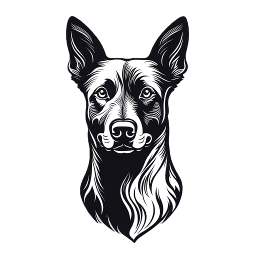

# 🐕 Kelpie API



`kelpie` is a workload-agnostic framework for shepherding long-running jobs to completion across a Salad Container Group, which consists of interruptible nodes.

## Swagger Docs

There are [live swagger docs](https://kelpie.saladexamples.com/docs) that should be considered more accurate and up to date than this readme.

## How it works

`kelpie` is a thin coordination layer (this API) and accompanying [worker binary](https://github.com/SaladTechnologies/kelpie) that helps guide your long-running jobs through to completion, through interruptions and ephemeral failures. You bring your own docker container, salad compute, storage, monitoring, etc. If configured via scaling rules, kelpie can also start, stop, and scale your container group in response to job volume.

## Adding the kelpie Worker To Your Container Image

```dockerfile
# Start with a base image that has the dependencies you need,
# and can successfully run your script.
FROM yourimage:yourtag

# Add the kelpie binary to your container image
ARG KELPIE_VERSION=0.5.1
ADD https://github.com/SaladTechnologies/kelpie/releases/download/${KELPIE_VERSION}/kelpie /kelpie
RUN chmod +x /kelpie

# Use kelpie as the "main" command. Kelpie will then execute your
# command with the provided arguments and environment variables
# from the job definition.
CMD ["/kelpie"]
```

When running the image, you will need additional configuration in the environment:

- AWS/Cloudflare Credentials: Provide `AWS_ACCESS_KEY_ID`, etc to enable the kelpie worker to upload and download from your bucket storage. We use the s3 compatibility api, so any s3-compatible storage should work.
- `KELPIE_API_URL`: the root URL for the coordination API, e.g. kelpie.saladexamples.com
- `SALAD_PROJECT`: the name of the Salad project you are using. This is used to scope your jobs and resources to a specific project.

Additionally, your script must support the following things:

- Saving and Resuming From Checkpoints: Your script should periodically output progress checkpoints to a directory configured in your job definition so that the job can be resumed if it gets interrupted. Similarly, when your script starts, it should check the configured directory to see if there is anything to resume, and only start from the beginning if no checkpoint is present.
- It must exit "successfully" with an exit code of 0 upon completion.

## What it DOES NOT do

1. kelpie does not store your data on our servers or in our storage buckets, beyond the job definition you submit. It merely facilitates syncing your data from local node storage to your preferred s3-compatible storage.
2. kelpie does not monitor the ongoing progress of your job, beyond ensuring it eventually exits successfully. You should integrate your own monitoring solution, e.g. [Weights and Balances](https://wandb.ai/)
3. kelpie does not containerize your job for you. It provides a binary that can be added to existing containerized jobs.
4. kelpie does not create or delete your container groups. If configured with scaling rules, kelpie can start, stop, and scale your container group in response to job volume.

## API Authorization

### Base URL

All API requests should use a base url of `https://kelpie.saladexamples.com`.

### Salad API Key

You will use your Salad API Key in the `Salad-Api-Key` header for all requests to the Kelpie API. This is used to authenticate you as a Salad user, and to authorize you to use the Kelpie API.

When using this key, you must also include two additional headers:

- `Salad-Organization`: The name of the Salad organization you are using
- `Salad-Project`: The name of the Salad project you are using

Many Kelpie operations are specific to a Salad organization and project, so these headers are required for all requests.

### Salad Instance Metadata Service (IMDS) JWT

Kelpie workers will use a JWT issued by the Salad Instance Metadata Service (IMDS) to authenticate themselves to the Kelpie API. This JWT is automatically provided by the Salad Container Group when the worker is running inside a Salad Container Group. This JWT is included in the `Authorization` header of all requests made by the Kelpie worker to the Kelpie API as a Bearer token.

Kelpie will also include the required `Salad-Project` header, using a value found in the environment variable `SALAD_PROJECT` set by you when configuring your container group.

### LEGACY: Kelpie API Key

Your kelpie api key is used by you to submit work, and also by kelpie workers to pull and process work.

All requests to the Kelpie API must include the header:

`X-Kelpie-Key: myapikey`

And you must include `KELPIE_API_KEY` in your environment variables when running the kelpie worker.


## Queueing a job

Queueing a job for processing is a post request to the Kelpie API.

This request will create a job in the Kelpie API, which will then be picked up by a Kelpie worker running on a Salad Container Group.

A Kelpie job definition consists of the following fields:

- `container_group_id`: The ID of the container group to run the job in. This works effectively as a queue id, with kelpie workers being able to automatically determine which jobs to run based on the container group they are running in. This is useful for ensuring that jobs are only run on the correct container group.
- `command`: The command to run in the container. This is the main entrypoint for your job.
- `arguments`: An array of arguments to pass to the command. This is passed as a list of strings.
- `environment`: An object containing environment variables to set for the job. The parent environment of the container is also passed to the job, with this block taking precedence in the event of a conflict.
- `sync`: An object containing the sync configuration for the job. This is used to download and upload files to/from your bucket storage.
  - `before`: An array of objects specifying files to download before the job starts. Each object should contain:
    - `bucket`: The name of the bucket to download from.
    - `prefix`: The prefix of the files to download.
    - `local_path`: The local path to download the files to.
    - `direction`: Should be "download".
  - `during`: An array of objects specifying files to upload during the job. Each object should contain:
    - `bucket`: The name of the bucket to upload to.
    - `prefix`: The prefix of the files to upload.
    - `local_path`: The local path to upload the files from.
    - `direction`: Should be "upload".
  - `after`: An array of objects specifying files to upload after the job completes. Each object should contain:
    - `bucket`: The name of the bucket to upload to.
    - `prefix`: The prefix of the files to upload.
    - `local_path`: The local path to upload the files from.
    - `direction`: Should be "upload".
- `webhook`: An optional URL to send a webhook to when the job starts, completes, or fails. This is useful for monitoring the status of your job.

### `POST /jobs`

**Request Body**

```json
{
  "command": "python",
  "arguments": [
    "/path/to/main.py",
    "--arg",
    "value"
  ],
  "environment": { "SOME_VAR": "string"},
  "sync": {
    "before": [
      {
        "bucket": "my-bucket",
        "prefix": "inputs/job1/",
        "local_path": "inputs/",
        "direction": "download"
      },
      {
        "bucket": "my-bucket",
        "prefix": "checkpoints/job1/",
        "local_path": "checkpoints/",
        "direction": "download"
      }
    ],
    "during": [
      {
        "bucket": "my-bucket",
        "prefix": "checkpoints/job1/",
        "local_path": "checkpoints/",
        "direction": "upload"
      }
    ],
    "after": [
      {
        "bucket": "my-bucket",
        "prefix": "outputs/job1/",
        "local_path": "outputs/",
        "direction": "upload"
      },

    ]
 },
  "webhook": "https://myapi.com/kelpie-webhooks",
  "container_group_id": "97f504e8-6de6-4322-b5d5-1777a59a7ad3"
}
```

**Response Body**

```json
{
  "id": "8b9c902c-7da6-4af3-be0b-59cd4487895a",
  "user_id": "your-user-id",
  "status": "pending",
  "created": "2024-04-19T18:53:31.000Z",
  "started": null,
  "completed": null,
  "canceled": null,
  "failed": null,
  "command": "python",
  "arguments": [
    "/path/to/main.py",
    "--arg",
    "value"
  ],
  "environment": { "SOME_VAR": "string"},
  "sync": {
    "before": [
      {
        "bucket": "my-bucket",
        "prefix": "inputs/job1/",
        "local_path": "inputs/",
        "direction": "download"
      },
      {
        "bucket": "my-bucket",
        "prefix": "checkpoints/job1/",
        "local_path": "checkpoints/",
        "direction": "download"
      }
    ],
    "during": [
      {
        "bucket": "my-bucket",
        "prefix": "checkpoints/job1/",
        "local_path": "checkpoints/",
        "direction": "upload"
      }
    ],
    "after": [
      {
        "bucket": "my-bucket",
        "prefix": "outputs/job1/",
        "local_path": "outputs/",
        "direction": "upload"
      }
    ]
  },
  "webhook": "https://myapi.com/kelpie-webhooks",
  "heartbeat": null,
  "num_failures": 0,
  "container_group_id": "97f504e8-6de6-4322-b5d5-1777a59a7ad3",
  "machine_id": null
}
```

### POST /jobs/batch

You can submit up to 1000 jobs at a time using the `/jobs/batch` endpoint. This is useful for bulk job submission.

**Request Body**

The request body is an array of job definitions, similar to the single job submission above. Each job definition should have the same structure as the single job submission.

```json
[
  {
    "command": "python",
    "arguments": [
      "/path/to/main.py",
      "--arg",
      "value"
    ],
    "environment": { "SOME_VAR": "string"},
    "sync": {
      "before": [
        {
          "bucket": "my-bucket",
          "prefix": "inputs/job1/",
          "local_path": "inputs/",
          "direction": "download"
        },
        {
          "bucket": "my-bucket",
          "prefix": "checkpoints/job1/",
          "local_path": "checkpoints/",
          "direction": "download"
        }
      ],
      "during": [
        {
          "bucket": "my-bucket",
          "prefix": "checkpoints/job1/",
          "local_path": "checkpoints/",
          "direction": "upload"
        }
      ],
      "after": [
        {
          "bucket": "my-bucket",
          "prefix": "outputs/job1/",
          "local_path": "outputs/",
          "direction": "upload"
        }
      ]
    },
    "webhook": null,
    "container_group_id": null
  }
]
```

**Response Body**

The response body is an array of job definitions, similar to the single job submission response. Each job definition will have an `id` field added, which is the unique identifier for the job.

```json
[
  {
    "id": "8b9c902c-7da6-4af3-be0b-59cd4487895a",
    "user_id": "your-user-id",
    "status": "pending",
    "created": "2024-04-19T18:53:31.000Z",
    "started": null,
    "completed": null,
    "canceled": null,
    "failed": null,
    "command": "python",
    "arguments": [
      "/path/to/main.py",
      "--arg",
      "value"
    ],
    "environment": { "SOME_VAR": "string"},
    "sync": {
      "before": [
        {
          "bucket": "my-bucket",
          "prefix": "inputs/job1/",
          "local_path": "inputs/",
          "direction": "download"
        },
        {
          "bucket": "my-bucket",
          "prefix": "checkpoints/job1/",
          "local_path": "checkpoints/",
          "direction": "download"
        }
      ],
      "during": [
        {
          "bucket": "my-bucket",
          "prefix": "checkpoints/job1/",
          "local_path": "checkpoints/",
          "direction": "upload"
        }
      ],
      "after": [
        {
          "bucket": "my-bucket",
          "prefix": "outputs/job1/",
          "local_path": "outputs/",
          "direction": "upload"
        }
      ]
    },
    "webhook": null,
    "heartbeat": null,
    "num_failures": 0,
    "container_group_id": null,
    "machine_id": null
  }
]
```

## Canceling a job

You can cancel a job using the job id

### `DELETE /jobs/:id`

**Response Body**

```json
{
  "message": "Job canceled"
}
```

## Checking on a job

As mentioned above, Kelpie does not monitor the progress of your job, but it does track the status (pending, running, canceled, completed, failed). You can get a job using the job id:

### `GET /jobs/:id`

**Response Body**

```json
{
  "id": "8b9c902c-7da6-4af3-be0b-59cd4487895a",
  "user_id": "your-user-id",
  "status": "pending",
  "created": "2024-04-19T18:53:31.000Z",
  "started": null,
  "completed": null,
  "canceled": null,
  "failed": null,
  "command": "python",
  "arguments": [
    "/path/to/main.py",
    "--arg",
    "value"
  ],
  "environment": { "SOME_VAR": "string"},
  "sync": {
    "before": [
      {
        "bucket": "my-bucket",
        "prefix": "inputs/job1/",
        "local_path": "inputs/",
        "direction": "download"
      },
      {
        "bucket": "my-bucket",
        "prefix": "checkpoints/job1/",
        "local_path": "checkpoints/",
        "direction": "download"
      }
    ],
    "during": [
      {
        "bucket": "my-bucket",
        "prefix": "checkpoints/job1/",
        "local_path": "checkpoints/",
        "direction": "upload"
      }
    ],
    "after": [
      {
        "bucket": "my-bucket",
        "prefix": "outputs/job1/",
        "local_path": "outputs/",
        "direction": "upload"
      }
    ]
  },
  "webhook": "https://myapi.com/kelpie-webhooks",
  "heartbeat": null,
  "num_failures": 0,
  "container_group_id": "97f504e8-6de6-4322-b5d5-1777a59a7ad3",
  "machine_id": null
}
```

## Listing Your Jobs

Get your jobs in bulk.

### `GET /jobs`

**Query Parameters**

All query parameters for this endpoint are optional.

| name               | description                                            | default |
| ------------------ | ------------------------------------------------------ | ------- |
| status             | pending, running, completed, canceled, failed          | *none*  |
| container_group_id | query only jobs assigned to a specific container group | *none*  |
| page_size          | How many jobs to return per page                       | 100     |
| page               | Which page of jobs to query                            | 1       |
| asc                | Boolean. Sort by `created`, ascending                  | false   |

**Response Body**

```json
{
  "_count": 1,
  "jobs": [
    {
      "id": "8b9c902c-7da6-4af3-be0b-59cd4487895a",
      "user_id": "your-user-id",
      "status": "pending",
      "created": "2024-04-19T18:53:31.000Z",
      "started": null,
      "completed": null,
      "canceled": null,
      "failed": null,
      "command": "python",
      "arguments": [
        "/path/to/main.py",
        "--arg",
        "value"
      ],
      "environment": { "SOME_VAR": "string"},
      "sync": {
        "before": [
          {
            "bucket": "my-bucket",
            "prefix": "inputs/job1/",
            "local_path": "inputs/",
            "direction": "download"
          },
          {
            "bucket": "my-bucket",
            "prefix": "checkpoints/job1/",
            "local_path": "checkpoints/",
            "direction": "download"
          }
        ],
        "during": [
          {
            "bucket": "my-bucket",
            "prefix": "checkpoints/job1/",
            "local_path": "checkpoints/",
            "direction": "upload"
          }
        ],
        "after": [
          {
            "bucket": "my-bucket",
            "prefix": "outputs/job1/",
            "local_path": "outputs/",
            "direction": "upload"
          }
        ]
      },
      "webhook": "https://myapi.com/kelpie-webhooks",
      "heartbeat": null,
      "num_failures": 0,
      "container_group_id": "97f504e8-6de6-4322-b5d5-1777a59a7ad3",
      "machine_id": null
    }
  ]
}
```

## Job Lifecycle

1. When kelpie starts on a new node, it starts polling for available work from `/work`. In these requests, it includes some information about what salad node you're on, including the machine id and container group id. This ensures we only hand out work to the correct container group, and that we do not hand out to a machine where that job has previously failed.
2. When a job is started, a webhook is sent, if configured.
3. Once it receives a job, kelpie downloads anything in `.sync.before`.
4. Once required files are downloaded, kelpie executes your command with the provided arguments, adding environment variables as documented above.
5. Whenever files are added to a directory configured in `.sync.during`, kelpie syncs the directory to the checkpoint bucket and prefix.
6. While the job is running, kelpie will periodically send a heartbeat to the API to indicate that the job is still running. This is used to detect if the job has been interrupted or failed, as well as to tell the worker if the job has been canceled.
7. When your command exits 0, the job is marked as complete, and a webhook is sent (if configured) to notify you about the job's completion.
   1. If your job has a `.sync.after` configured, kelpie will upload the contents of that directory to the configured bucket and prefix before marking the job as complete.
   2. If your job fails, meaning exits non-0, it will be reported as a failure to the api. When this occurs, the number of failures for the job is incremented, up to 3. The machine id reporting the failure will be blocked from receiving that job again. If the job fails 3 times, it is marked failed, and a webhook is sent, if configured. If a machine id is blocked from 5 jobs, the container will be reallocated to a different machine, provided you have added the kelpie user to your salad org.
8. All configured directories in `.sync` are wiped out to reset for the next job.

## Status Webhooks

If you provide a url in the webhook field, the Kelpie API will send status webhooks. It makes a `POST` request to the url provided, with a JSON request body:

```json
{
  "status": "running",
  "job_id": "some-job-id",
  "machine_id": "some-machine-id",
  "container_group_id": "some-container-group-id"
}
```

Webhook status may be `running`, `failed`, or `completed`

### Webhook Authorization

Webhooks sent by the Kelpie API will be secured with your API token in the `X-Kelpie-Key` header.

## Developing Locally

### Getting Started

1. Clone the repo
2. run `npm install` to install dependencies
3. Copy `example-wrangler.toml` to `wrangler.toml`.
4. Run `npm start` to initiate the local environment and start the server
5. Run `./setup-db.sh --local` to set up the local database

Now navigate to the local server's swagger docs at `http://localhost:8787/docs`.

### Running Tests

1. Make sure the server is started with `npm start`
2. (Only the first time) Run `./setup-tests.sh` to set up the test environment
3. Run `npm test` to run the test suite
